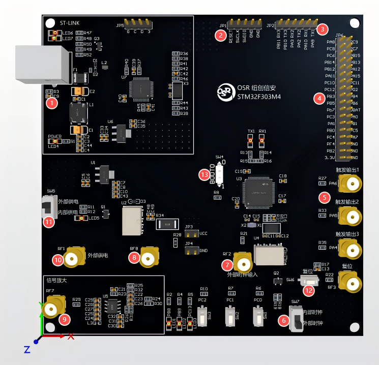
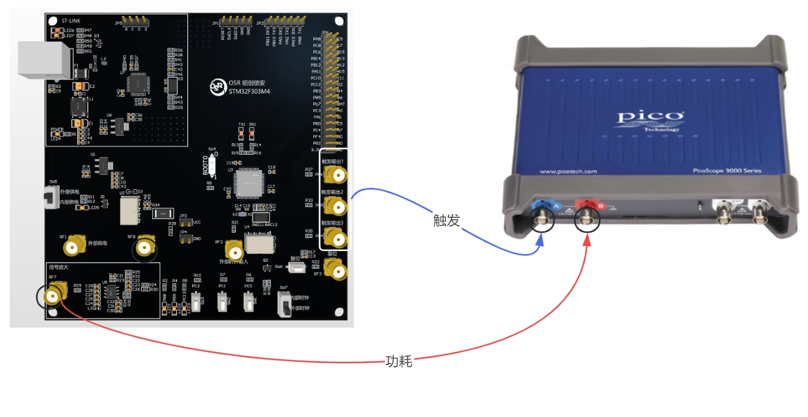
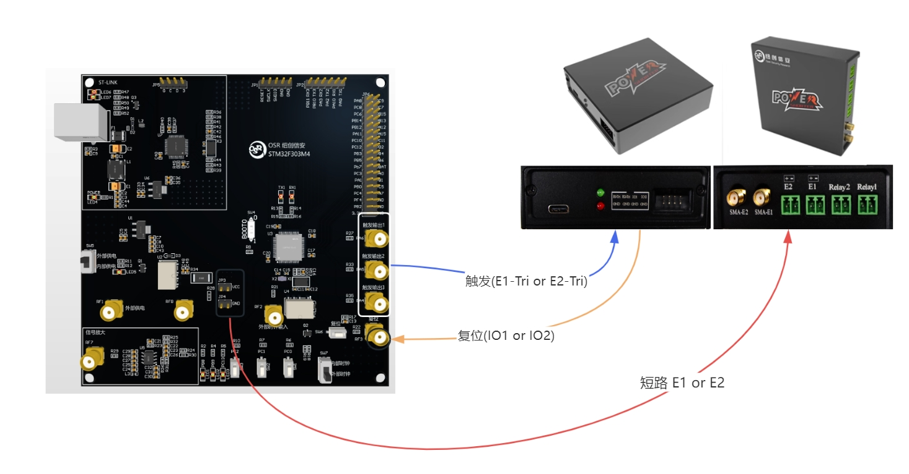
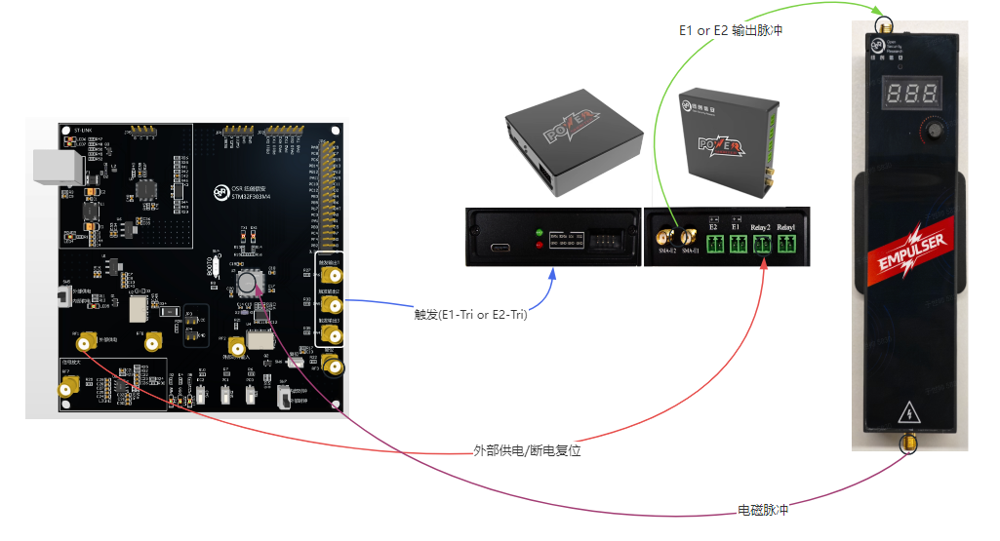
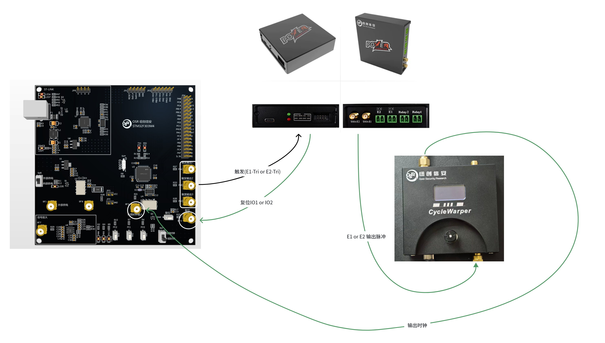

# OSR-303 Hardware Security Evaluation Board
> If this experimental platform is helpful to your research and experiments, we would greatly appreciate it if you could cite this project in your papers and recommend it to others!

The OSR-303 hardware security evaluation board is a development and evaluation board customized specifically for hardware security experiments. It lets you quickly build side-channel and fault-injection experimental setups for studying and experimenting with related topics.

The core of the OSR-303 evaluation board is the STM32F303RCT6 chip, based on the ARM Cortex-M4 architecture. The board provides serial-port and debugging functionality: a single USB cable is enough for host-computer communication, program downloading, and debugging, greatly simplifying the effort of setting up the environment.

The main specifications of the OSR-303 are listed in the table below:

| Microprocessor | STM32F303RCT6 |
| :------------- | :------------ |
| Supply voltage | 5V            |
| Flash          | 256KB         |
| Crystal        | 8MHz          |

## Hardware Interfaces
The board's interfaces are described in the table below. The location of each interface corresponds to the numbered labels in the figure below.

| No.  | Interface                     | Description                                                                                     |
| :--- | :---------------------------- | :---------------------------------------------------------------------------------------------- |
| 1    | USB port                      | Provides 5V supply voltage and connects to the PC for debugging, program download, and UART data transmission |
| 2    | Independent SWD port          | Used for program download and debugging; can be connected to a standalone ST-Link                |
| 3    | Independent serial port       | Used for host-computer communication; can be connected to a standalone serial adapter            |
| 4    | GPIO port                     | Breaks out 32 GPIO pins; the silkscreen matches the MCU chip pins                                |
| 5    | Trigger output port           | 3 trigger output ports; the silkscreen matches the MCU chip pins                                 |
| 6    | Clock selection switch        | Switches between the internal clock and the external clock                                       |
| 7    | External clock input port     | External clock input port (used for clock fault-injection experiments)                           |
| 8-9  | Side-channel power collection port | 8 is the power collection port on the MCU side of the sampling resistor; 9 is the amplified signal output of port 8 |
| 10   | External power input port     | External supply input for the MCU core                                                            |
| 11   | Core power selection switch   | The MCU core can be powered internally by the board or externally via port 10, selected with switch 11 |
| 12   | Reset switch                  | Used to reset the program                                                                         |
| 13   | Bootloader pin                | Used to select the chip's boot mode; defaults to main-flash boot with BOOT0 = 0                  |

For normal use, the switches should be set as follows:
| Switch | Default          | Description                                    |
| :----- | :--------------- | :--------------------------------------------- |
| SW5    | Internal supply  | Normally does not need to be changed           |
| SW7    | Internal clock   | Normally does not need to be changed           |
| SW4    | 0                | This switch selects the BOOT0 mode; keep it at 0 |

## Side-Channel Acquisition
The principle of power acquisition is to place a sampling resistor in series with the MCU chip's supply rail. As the MCU performs computations, current flows through the sampling resistor and produces a voltage drop across it. Measuring this voltage drop reflects the MCU chip's power consumption.

On the OSR-303, `RF7` and `RF8` can be used for voltage/power-trace acquisition, where `RF7` is the output after the signal-amplification module. In general, acquiring through the `RF7` port is sufficient.

We recommend using a `PicoScope` oscilloscope for side-channel acquisition. See [pico3000](https://gitee.com/osr-tech/pico3000) for the device control scripts.

## Voltage Short-Circuit Fault Injection
Voltage short-circuit fault injection momentarily shorts the MCU's core voltage to ground while the MCU is running, disturbing its normal operation and producing errors. Short-circuit fault injection can be achieved with [PowerShorter](https://gitee.com/osr-tech/powershorter).

Connect the `+` of `PowerShorter` to `JP3` (any pin) and the `-` to `JP4` (any pin), then configure the trigger to perform voltage short-circuit fault injection.

## Electromagnetic Fault Injection
Electromagnetic fault injection generates a momentary electromagnetic pulse while the MCU is running, disturbing its normal operation and producing errors. Electromagnetic fault injection can be achieved with [PowerShorter](https://gitee.com/osr-tech/powershorter) and EMPulse.

Connect `E1 or E2` of `PowerShorter` to `EMPulse` and configure the relevant parameters to generate electromagnetic pulses. When the electromagnetic pulse disturbs the MCU to the point where it can no longer operate, the relay on the PowerShorter is needed to perform a hard reset of the target.

## Clock Fault Injection
Clock fault injection introduces illegal clock glitches while the MCU is running, disturbing its normal operation and producing errors. Clock fault injection can be achieved with [PowerShorter](https://gitee.com/osr-tech/powershorter) and CycleWarper.

Connect `E1 or E2` of `PowerShorter` to `CycleWarper` and configure the relevant parameters to generate a faulty clock. When the faulty clock disturbs the MCU to the point where it can no longer operate, the GPIO on the PowerShorter is needed to perform a hard reset of the target. Set the board's clock selection switch `SW7` to the external clock and feed in the external clock fault-injection device through `RF2`.

