# Setting Up the 303 Side-Channel / Fault Environment with STM32CubeIDE

The core of the OSR-303 evaluation board is the STM32F303RCT6 chip, based on the ARM Cortex-M4 architecture. We recommend using STM32CubeIDE to set up the side-channel / fault environment for the 303 evaluation board. STM32CubeIDE integrates STM32CubeMX's STM32 configuration and project-creation features, providing an all-in-one tool experience and saving development time.


## 1. Download and Install STM32CubeIDE

[Official download page](https://www.st.com.cn/zh/development-tools/stm32cubeide.html). You need to register an account during the download process. Once downloaded, install it normally.


## 2. Create an STM32 Project

Run STM32CubeIDE and choose from the menu:
File >> New >> STM32Project to create a new STM32 project.

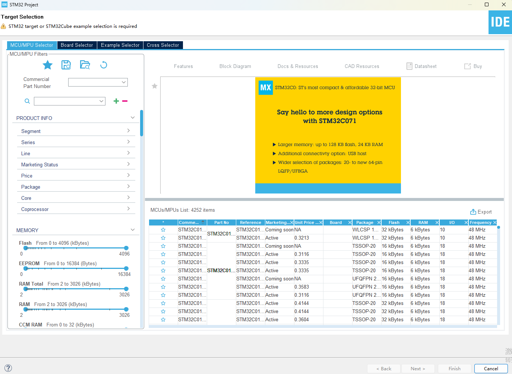

## 3. Select the Core Chip of the 303 Evaluation Board

In the "Commercial Part Number" text box, search for "STM32F303RCT6".

In the MCUs/MPUs List, select the "STM32F303RCT6" entry and click Next.

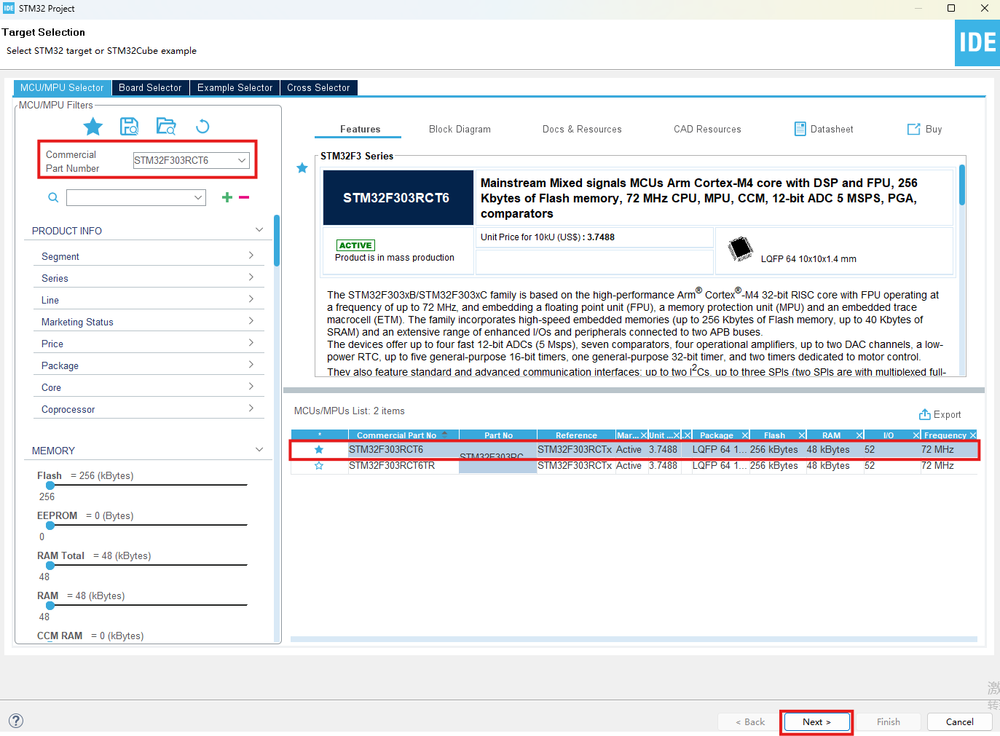

Use the default configuration to finish creating the project: name the project >> Finish.

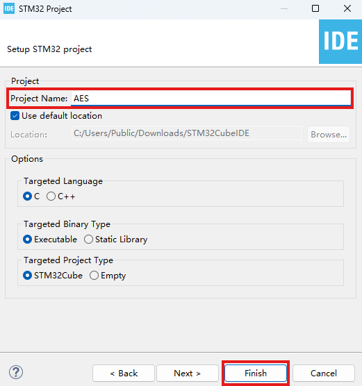

## 3. Chip Configuration

Open the IOC file to configure the chip:

### 1. Configure pin PA6 as GPIO_Output:

Pinout & Configuration >> Pinout view >> PA6 >> GPIO_Output

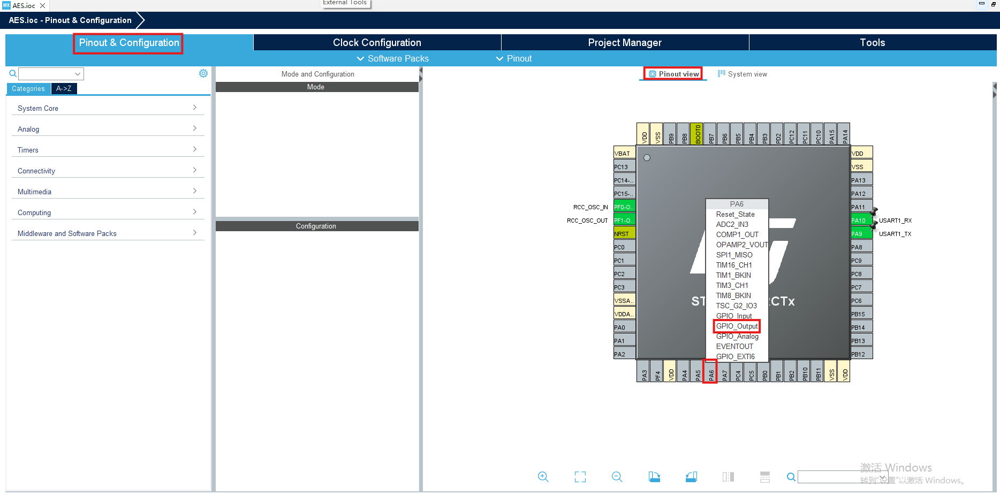

### 2. Configure PA9 and PA10 as USART1_TX and USART1_RX respectively:

Pinout & Configuration >> Pinout view >> PA9 >> USART1_TX

Pinout & Configuration >> Pinout view >> PA10 >> USART1_RX

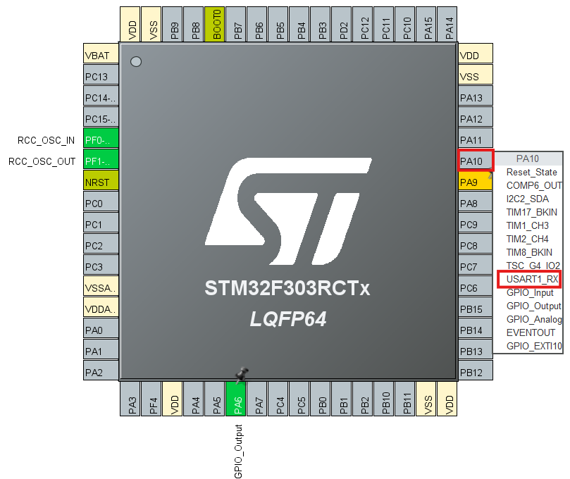

### 3. Set the UART1 serial baud rate

Pinout & Configuration >> Connectivity >> USART1

Mode >> Asynchronous.

Baud Rate >> 115200 Bits/s.

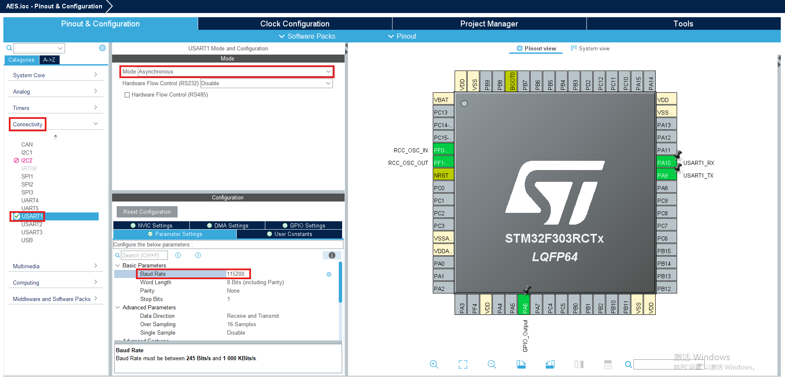

### 4. RCC settings

Pinout & Configuration >> System Core >> RCC >> High Speed Clock (HSE) >> Crystal/Ceramic Resonator.

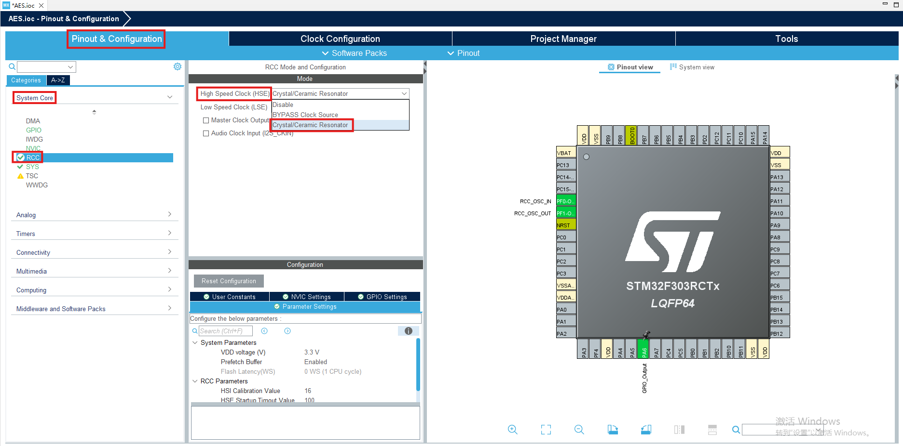

### 5. Clock settings

Clock Configuration >> HSE >> PLLCLK.

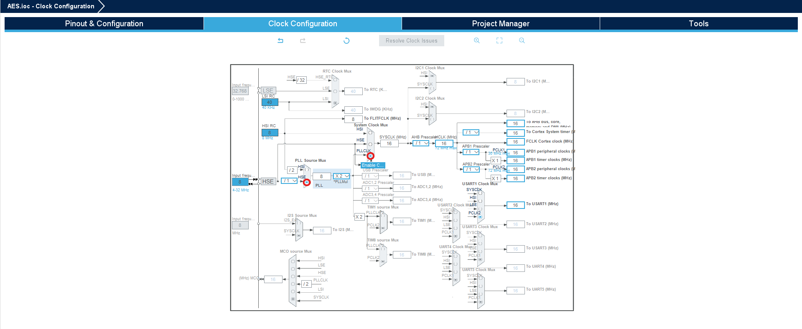

### 6. Save and complete the configuration

Click "Device Configuration Tool Code Generation" in the menu bar to save and complete the configuration. STM32CubeIDE will automatically generate the corresponding code.


## 4. Write the Project Code

Next, you can write your own code in STM32CubeIDE. The following uses an AES algorithm implementation as an example:

### 1. Implement the AES encryption functionality

Here, after we write the AES-related code and save it as aes.h and aes.c, we place the code files into the corresponding directory.

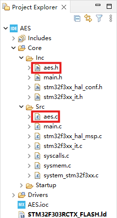

### 2. Writing the main.c code

main.c already contains code auto-generated by STM32CubeIDE. The code we write must be placed between the USER CODE BEGIN and USER CODE END blocks.

For example, header-file includes go in Private includes:

```c
/* Private includes ----------------------------------------------------------*/
/* USER CODE BEGIN Includes */
#include "aes.h"
#include <stdint.h>
/* USER CODE END Includes */
```

Variable definitions go in Private variables:


```c
/* Private variables ---------------------------------------------------------*/
UART_HandleTypeDef huart1;

/* USER CODE BEGIN PV */
uint8_t key[] = {
    0x00, 0x01, 0x02, 0x03,
    0x04, 0x05, 0x06, 0x07,
    0x08, 0x09, 0x0a, 0x0b,
    0x0c, 0x0d, 0x0e, 0x0f};

uint8_t w[512];

/* USER CODE END PV */
```

Below is the complete code for main.c:


```c
/**
  * @brief  The application entry point.
  * @retval int
  */
int main(void)
{

  /* USER CODE BEGIN 1 */
	uint8_t cipher[16];
	uint8_t plain[16];
	int ret = 0;
  /* USER CODE END 1 */

  /* MCU Configuration--------------------------------------------------------*/

  /* Reset of all peripherals, Initializes the Flash interface and the Systick. */
  HAL_Init();

  /* USER CODE BEGIN Init */

  /* USER CODE END Init */

  /* Configure the system clock */
  SystemClock_Config();

  /* USER CODE BEGIN SysInit */

  /* USER CODE END SysInit */

  /* Initialize all configured peripherals */
  MX_GPIO_Init();
  MX_USART1_UART_Init();
  /* USER CODE BEGIN 2 */
  aes_init(16);
  aes_key_expansion(key, w);

  /* USER CODE END 2 */

  /* Infinite loop */
  /* USER CODE BEGIN WHILE */
  while (1)
  {

	 ret = HAL_UART_Receive(&huart1, plain, 16, HAL_MAX_DELAY);		// receive 16 bytes of plaintext from the serial port
	 if(ret==HAL_OK)
	 {
	     __disable_irq();  // disable interrupts
		 HAL_GPIO_WritePin(GPIOA, GPIO_PIN_6, 1); // drive the level high before encryption as a trigger signal
		 aes_cipher(plain, cipher, w);
		 HAL_GPIO_WritePin(GPIOA, GPIO_PIN_6, 0); // drive the level low after encryption
		 __enable_irq();  // enable interrupts
		 HAL_UART_Transmit(&huart1, cipher, 16, HAL_MAX_DELAY);		// send 16 bytes of ciphertext to the serial port
	 }

    /* USER CODE END WHILE */

    /* USER CODE BEGIN 3 */
  }
  /* USER CODE END 3 */
}
```

## 3. Download and Run the Code

Click "Run AES Debug" in the menu bar.

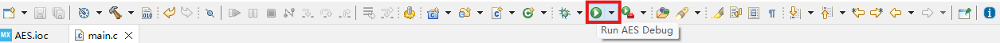

Use a local serial debugging tool, or an [online serial tool](https://www.wshell.cc/).

Open the serial port >> ST-Link VCP Ctrl (COM3) >> Connect.

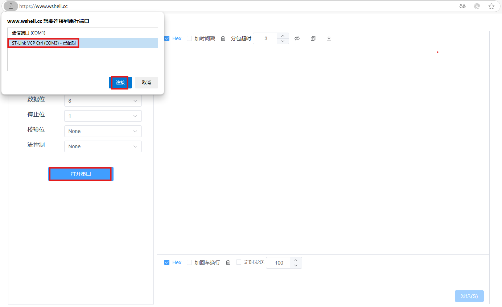

Send 16 bytes of plaintext, and you will receive the encrypted ciphertext.

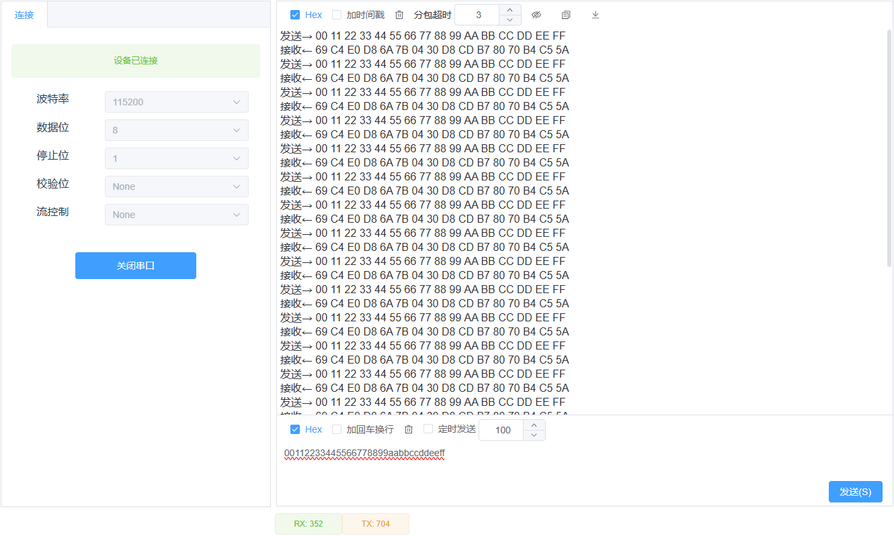
